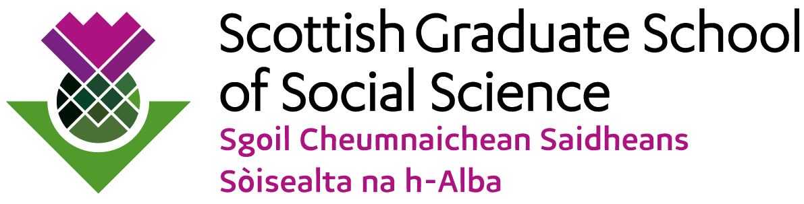

# Text Analysis for Social Scientists

## Introduction

Computational methods are transforming research practice across the disciplines. In this one-day course you will learn how to apply computational methods for the analysis of text data. Using Python and R, you will develop skills in preprocessing text, creating document-term matrices, generating descriptive summaries (word clouds, keywords-in-context, collocations), fitting topic models (LDA), and exploring how LLMs can support text analysis tasks.

This course is suitable for social science researchers from any methodological background (e.g., qualitative, quantitative) and who are new to the use of computational methods in their research. Participants are not expected to have any experience of using Python or R before attending this course.

## Course materials

This repository houses the materials underpinning the one-day course run by [Dr Diarmuid McDonnell](https://www.gradelinstituteofcharity.co.uk/diarmuid-mcdonnell), Braw Data Ltd / Gradel Institute of Charity, University of Oxford. The course was first run in March 2026.

### Programme

| Time | Session | Format |
|------|---------|--------|
| 10:00-10:30 | Lecture 1: Welcome & Text as Data | Lecture |
| 10:30-11:00 | Practical 1: Preprocessing Text | Colab notebook |
| 11:00-11:15 | Break | |
| 11:15-11:30 | Lecture 2: Exploring Text | Lecture |
| 11:30-12:15 | Practical 2: Descriptive Text Analysis | Colab notebook |
| 12:15-13:00 | Lunch | |
| 13:00-13:30 | Lecture 3: Topic Modelling | Lecture |
| 13:30-14:45 | Practical 3: Topic Modelling | Colab notebook |
| 14:45-15:00 | Break | |
| 15:00-15:15 | Lecture 4: LLMs for Text Analysis | Lecture |
| 15:15-15:50 | Practical 4: LLM-Assisted Text Analysis | Colab notebook |
| 15:50-16:00 | Wrap-up & Q&A | |

### Interactive coding materials

The practicals contain Python and R code for you to execute.

You can complete the lessons online without the need to install or download anything. Simply click on the relevant link for each lesson below.

You need a Google account to be able to run the code notebooks. Once you have a [Google account](https://support.google.com/accounts/answer/27441?hl=en) then please click the *Open in Colab* link.

#### Python

* Practical 1: Preprocessing Text 
* Practical 2: Descriptive Text Analysis 
* Practical 3: Topic Modelling 
* Practical 4: LLM-Assisted Text Analysis 

#### R

* Practical 1: Preprocessing Text 
* Practical 2: Descriptive Text Analysis 
* Practical 3: Topic Modelling 
* Practical 4: LLM-Assisted Text Analysis 

### Presentations

* [Lecture 1: Welcome & Text as Data](./presentations/lecture-1-welcome-and-text-as-data.pdf)
* [Lecture 2: Exploring Text](./presentations/lecture-2-exploring-text.pdf)
* [Lecture 3: Topic Modelling](./presentations/lecture-3-topic-modelling.pdf)
* [Lecture 4: LLMs for Text Analysis](./presentations/lecture-4-llms-for-text-analysis.pdf)

### Other materials

* [installation](./installation) - Guidance on installing software on your own machines.
* [reading](./reading) - Lists of interesting and relevant reading materials.

## Instructor

**Dr Diarmuid McDonnell**
Director, [Braw Data Ltd](https://www.brawdata.co.uk)
Visiting Fellow, [Gradel Institute of Charity](https://www.gradelinstituteofcharity.co.uk/diarmuid-mcdonnell), University of Oxford

## Acknowledgements

I am grateful to the Scottish Graduate School of Social Sciences (SGSSS) for funding and organising this course.

## Licence

These materials are licensed under a [Creative Commons Attribution 4.0 International Licence (CC BY 4.0)](https://creativecommons.org/licenses/by/4.0/).

## Further information

Please do not hesitate to get in contact if you have queries, criticisms or ideas regarding these materials: [Dr Diarmuid McDonnell](mailto:diarmuid@brawdata.com)
